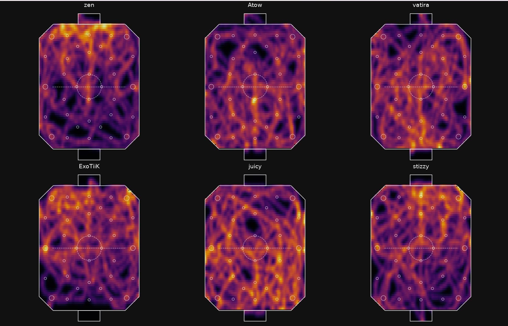
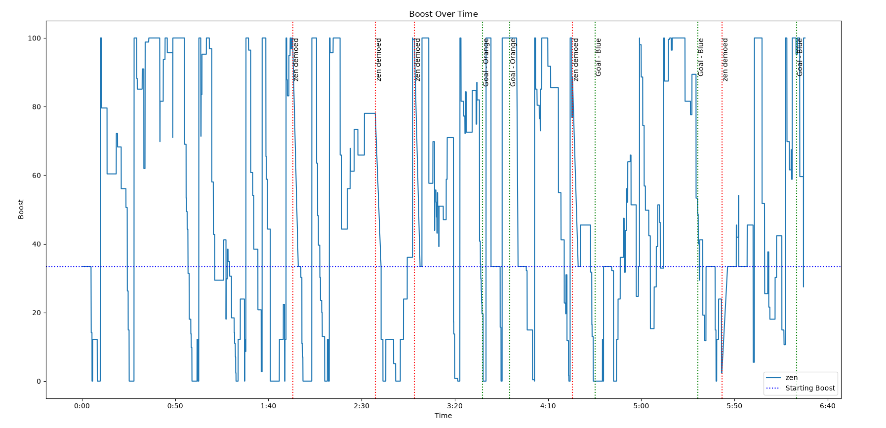
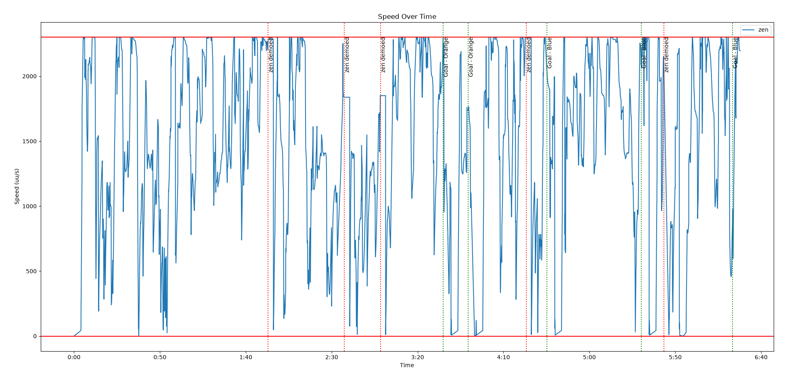
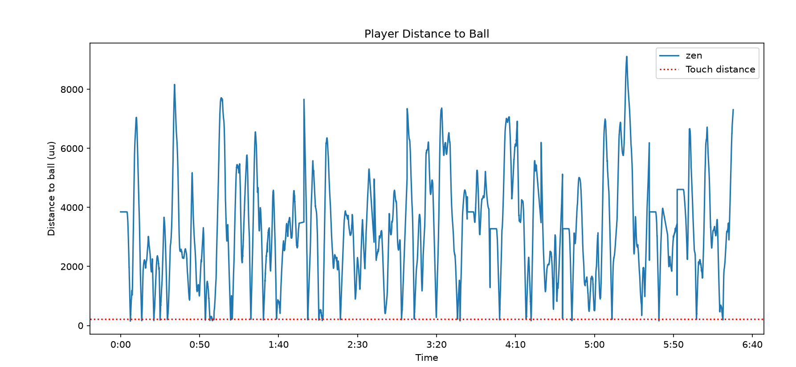
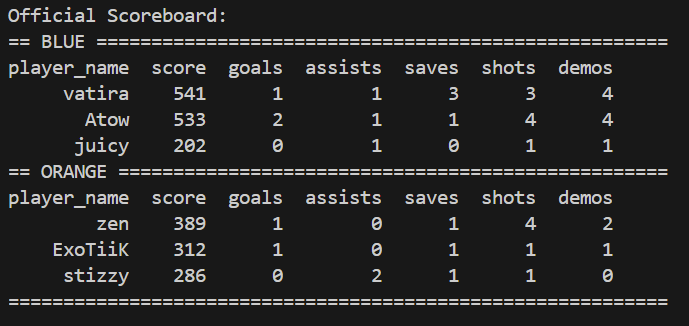
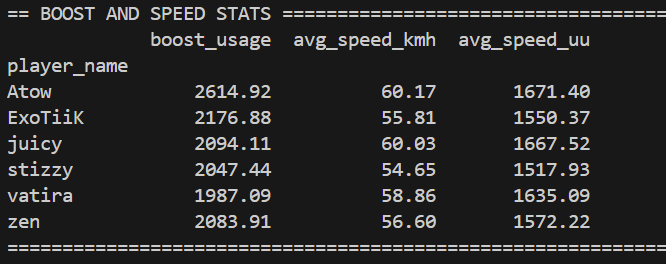

# RLCS Analytics

An analytics pipeline for extracting gameplay data from Rocket League replay
files and turning it into player-level statistics, event timelines, and
visualizations.

The project is focused on building reliable, frame-aware data foundations for
advanced metrics such as shot quality and expected goals (xG).

## Highlights

- Built a replay ETL pipeline around `rrrocket` JSON output.
- Reconstructed delayed Rocket League actor relationships across PRI, car, and
  component actors.
- Added pending observation resolution so boost and physics updates are not lost
  when network links arrive in later frames.
- Generated structured event metadata for goals, demos, resets, saves, and other
  replay tick marks.
- Implemented reset-aware boost usage analysis that separates baseline resets
  from actual boost consumption.
- Implemented frame-level speed and physics calculations.
- Built touch detection using player-ball distance, ball velocity impulses,
  replication timing windows, kickoff handling, and contact clustering.
- Added debugging visualizations for player position heatmaps and player-ball
  distance over time.
- Added automated tests for delayed actor linking, event normalization, boost
  resets, and touch detection.

## Current Analytics Output

Each processed replay produces:

- A frame-level CSV containing player and ball state such as position, velocity,
  orientation, boost, and dodge state.
- Metadata JSON containing match properties, scoreboard data, aggregate demos,
  and a canonical event stream.
- Derived analysis including boost usage, average speed, number of touches, and
  player summaries.

## Architecture

```text
analytics/
├── src/
│   ├── domain/          Shared parser data models
│   ├── parsing/         Replay parsing, actor links, events, and CLI
│   ├── analysis/        Boost, speed, touch, scoreboard, and aggregation logic
│   └── visualization/   Charts, heatmaps, overlays, and terminal output
├── tests/               Regression and analysis tests
├── data/
│   ├── json/            rrrocket JSON input
│   └── processed/       Frame CSV and metadata output
└── scripts/              Replay processing helpers
```

The parser, analysis functions, and visualization layer are separated so
frame-level transformations can be reused by later metrics and interfaces.

## Visualizations

The analytics package currently supports:

- Player position heatmaps over the Rocket League pitch.
- Player speed over time.
- Player boost over time.
- Player distance to the ball over time for touch-detector debugging.
- Speed and boost numerical stats
- Scoreboard display

**Position Heatmaps**

In the above visualization of player position heatmaps, we can see stark differences in how the teams play. Vitality (zen, ExoTiiK, stizzy) all spend much more time in their halves then the KC (vatira, atow, juicy) do. KC are much more spread throughout the pitch. This lines up with the general thought that Vitality plays more of a counter attacking style, meaining they spend more time defending in their half.

**Deep dive into zen's boost and speed**



Here we can see how zen spent boost throughout the game and how he kept up his speed. We can also see his distance from the ball, helping to see how aggressive he was. We can also use the distance chart to help determine when he touched the ball.

**Printed Stats**


These stats show a numerical comparison between players. The scoreboard is the standard scoreboard that appears in game. The boost and speed helps see how fast players play and how much boost they use. From this, we can see that the KC players were all faster on average than the Vitality players, with Atow being the fastest in this game. Atow also uses more boost than anyone else in the lobby. It should be noted that a faster average speed and more boost used is not necessarily better. In this game specifically, Vitality was winning until KC got 2 late goals to tie the game, where they won in overtime.


```text
docs/images/player-position-heatmap.png
docs/images/player-ball-distance.png
```

## Quick Start

From the `analytics` directory, install the Python dependencies:

```bash
pip install -r requirements.txt
```

Process an existing `rrrocket` JSON file:

```bash
python -m src.parsing.cli data/json/replay.json
```

Or process a replay file through the shell helper, which runs `rrrocket` and
then the Python parser:

```bash
./scripts/process_replay.sh path/to/replay.replay
```

Analyze a processed match:

```bash
python main.py <match_guid>
```

Run the test suite:

```bash
pytest
```

## Example Match

The repository includes a processed replay fixture for local development and
regression testing. It contains frame data, match metadata, player events, touch
candidates, and visualization inputs.

## Roadmap

- Improve touch attribution using richer collision and actor-state evidence.
- Simulate post-touch trajectories to classify shots.
- Build shot-location and shot-quality features.
- Estimate expected goals (xG) from shot context, location, velocity, angle, and
  defensive state.
